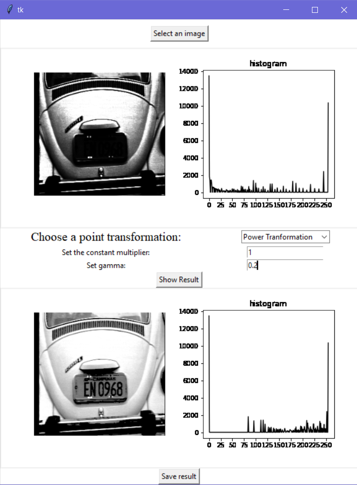

# Python GUI for selecting Point Transformations

This is a user friendly Jupyter notebook program that allows the user to choose an image, display it as well as its histogram(s) and apply to it any one of the following point transformations: *linear stretching*, *histogram equalization*, and *power transformation*.

It is a python GUI for image transformations built using Tkinter

## Features
- GUI using Tkinter
- Upload an image
- Supports both Grayscale and RGB images
- Histograms for the images
- User is able to save the output

## Screenshots

**Histogram Equalization:** 

**Linear Stretching:** 

**Power Transformation:** 

